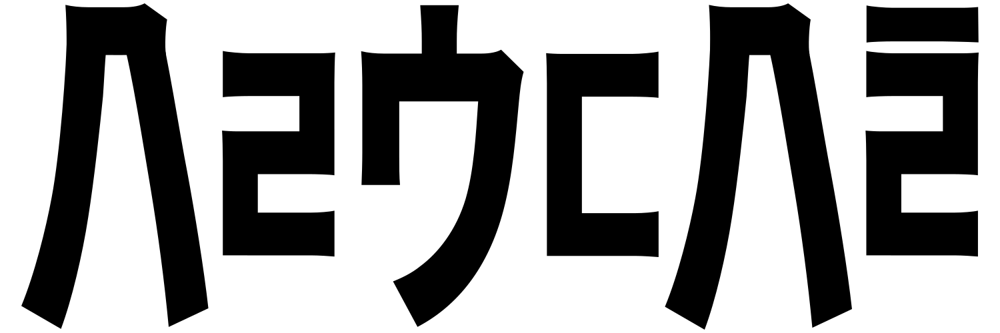

bal'ukbar constructive grammar
==============================

Version 0.2 (This is still a work in progress and not usable. Also this document is by no means a formal description of the grammar, instead it's a dense definition of the language. There are large portions missing, outdated, wrong and whatever.)

Language of Ukbar
-----------------

Bal'ukbar (or "Palhuqpar") is a constructed language (conlang). To be more precise an engineered language.  
The current plan is to develop it to a point where it is possible to start learning it.

Here, have an example:  
ﾂ ﾏ ｾ ｦｴﾚ̥ ﾖﾩ̄ﾅ̄ ･ ﾌｱﾌｱ｡  
**tu ma hi voele corña - huahua**  
[tu˦ ma hi˦ ɸɔ.ɛ'lɛ tɕɔr'ɲa hu'a.hu.a]  
tu ma hi (vo(ele) cor(ña)) - huahua  
listener.is.topic Q change towards.speaker-move to east windy  
"Will you come east to me, fast like the wind?"  

The defining feature are its word classes: filter, content, comment. Which have this fixed order and can form nested noun phrases. In interlinear glossing the internal structure is indicated with parenthesis in an additional line. This way all sentences can be analyzed as only consisting of lists and filters.

In general every element of a sentence is optional. That is, it can be omitted without changing the meaning of the remaining sentence. In practice this means that there are no such things as negation.

Structure of this documentation
-------------------------------

"[Introduction](Introduction.md)" (outdated) Gives an overview over the intentions and philosophy and what makes it special.  
"[Phonology](Phonology.md)" Phonemes, syllable structure, stress and phonotactics.  
"[Grammar](Grammar.md)" Grammar.  
"[Diachronic](Diachronic.md)" Lists past and future changes to phonology.  
"[Lexicon](Lexicon.md)" Lists all words not explained in the Grammar in no particular order.  
"[Kana](Kana.md)" Writing system adapted from Japanese katakana with elements of hangul as coda.  

License
-------

Even though, according to my understanding, you can not license a language I want to explicitly state, that this language is in the public domain.

This documentation is licensed under CC-BY-SA.  
If anyone for some reason is using this conlang I also want to encourage them to publish their original writings too under a free and copyleft license.
